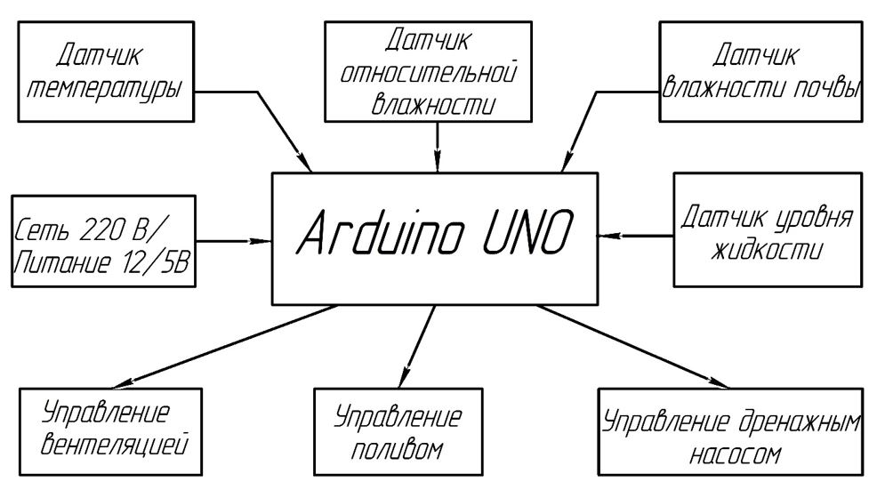
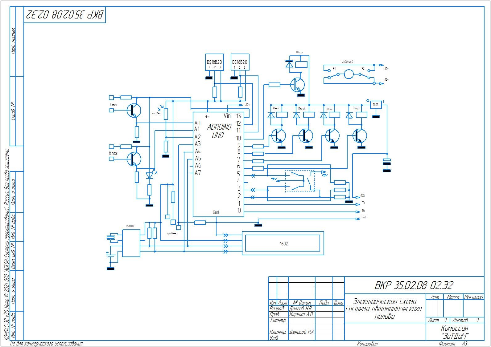
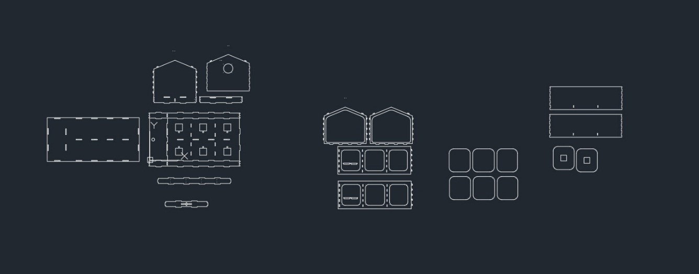
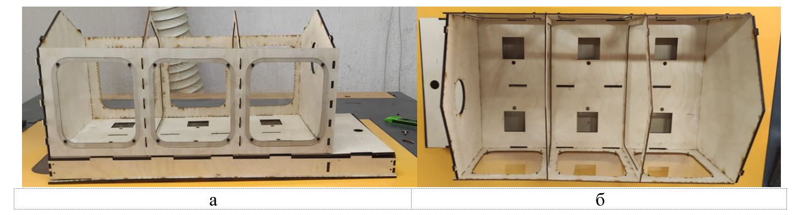
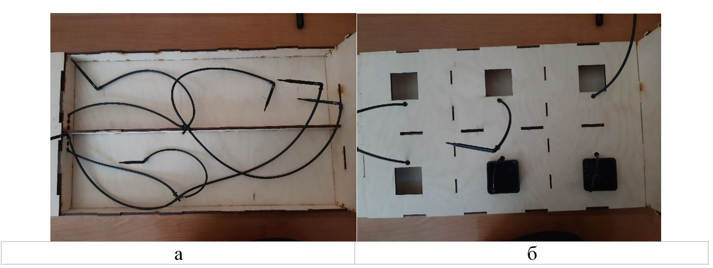
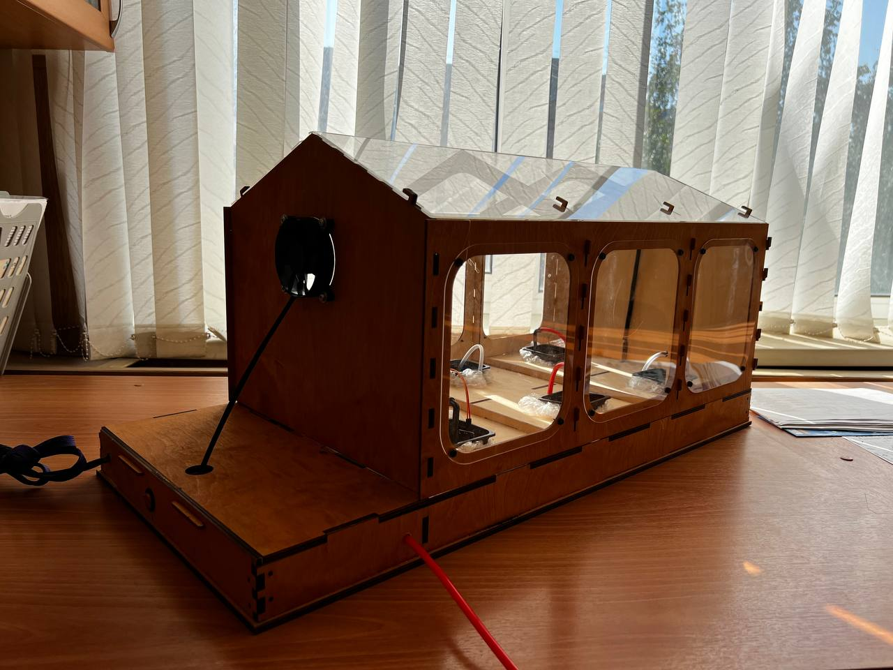
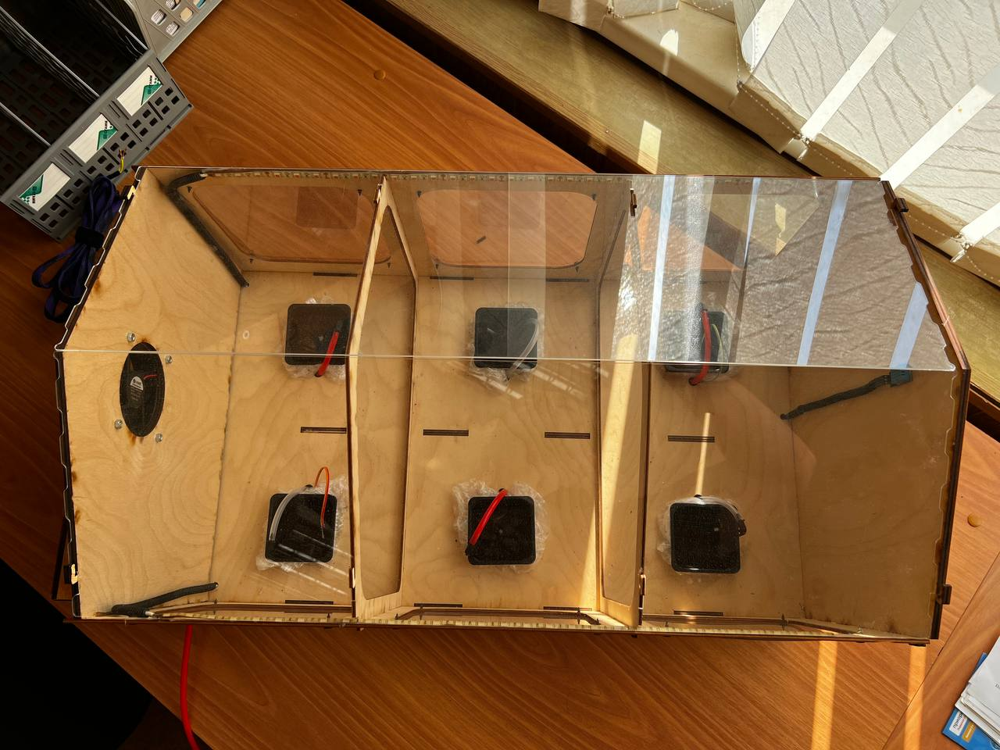

# Контроль и управление температурой, влажностью воздуха и освещением в теплице

## 📋 Общая информация

### Структурная схема автоматизации теплицы

 Выполнив анализ существующих систем автоматического полива и узнав, как они функционирую, то мы можем создать структурную схему будущей автоматической системы полива на основе микроконтроллера Arduino или ESP32.
 В основе разработанной структурной схемы лежит 4 блока: блок питания системы, блок измерений (датчик влажности, датчик уровня жидкости, датчик температуры и датчик относительной влажности), блок управления системой (Arduino/ESP32), блок электродвигателей. 

### Компоновка устройства автоматического полива

1. Иотик 32В - микроконтроллер, основанный на ESP32. Имеет встроенные часто используемые интерфейсы: GPIO, I2C, ADC, SPI. Также имеется Wi-Fi и Bluetooth.
2. Датчик влажности почвы в форме вилки с двумя открытыми проводками и действует он как переменный резистор, 
сопротивление которого изменятся в зависимости от содержания влаги в почве. Если на сопротивление датчика ниже заданного, 
то на плату подается сигнал от том что почва сухая и требует полива в зависимости от заданного режима работы.
3, Датчик влажности и температуры DHT11 состоит из двух частей – емкостного датчика температуры и гигрометра. Первый используется для измерения температуры, второй – для влажности воздуха. 
Находящийся внутри чип может выполнять аналого-цифровые преобразования и выдавать цифровой сигнал, который считывается посредством микроконтроллера.
4. Насос подачи воды в систему капельного полива. Для проверки требовался насос для подачи воды в систему, также требовалась емкость откуда будет производиться забор воды. Для выполнения данной задачи был выбран моторчик стеклоомывателя ВАЗ 2107, так как он идет в комплектации вместе с баком, что решает сразу две проблемы с насосом и баком для забора воды. 
5. Датчик уровня жидкости содержит ряд из десяти открытых медных дорожек, пять из которых являются питающими, а пять – чувствительными. Эти дорожки чередуются так, что между каждыми двумя питающими дорожками есть одна чувствительная дорожка.
6. Жидкокристаллический дисплей (Liquid Crystal Display) LCD 1602 стоит недорого, есть различные модификации с разными цветами подсветки, можно легко скачать готовые библиотеки для скетчей Иотик 32В.
7. Светодиодная лента - фитолента 4 метра 
8. Вентилятор для продувки теплицы 
9. Датчик освещенности (Trema-модуль)позволит контролировать уровень освещенности.С помощью данного датчика освещенности можно управлять освещением, автоматически включать свет, когда наступает ночь и многое другое.
10. Релейный модуль – это шлюз, который позволяет соединить вместе электрические цепи с совершенно разными параметрами.
 

### Принцип работы автоматизации теплицы
Исходя из вышеперечисленных данных элементов системы полива будет работать на основе датчиков и микроконтроллера. Йотик 32В в свою очередь будет обрабатывать данные датчика температуры, сравнивая их с разрешённым параметром. При достижении максимальной влажности 80% будет 
включаться вентиляция и снижать уровень влажности в помещении до допустимого уровня влажности в размере 60-65% и уже при достижении данного значения с помощью того же датчика влажности на Йотик 32В подаст сигнал для выключения вентиляции. В системе также будет задействован датчик влажности почвы который будет отвечать за работу помпы для полива. При достижении низкого уровня влажности почвы Йотик 32В после обработки полученной информации подает сигнал на релейный модуль который подключен к питанию на 12V, цепь катушки замыкается
и включается помпа для полива. После достижения нормированного уровня влажности Йотик 32В завершает полив.
Для отслеживания уровня воды в ёмкости мы будем использовать датчик уровня воды. При достижении определённого уровня воды в баке на Йотик 32В поступит информация о том, что воды в баке практически не
осталось и этого количества воды недостаточно для полива. Для наглядности используется светодиод. Если диод горит зеленым цветом, то это означает, что воды баке достаточно. 
Когда горит желтый, то это означает что уровень воды в баке приближается максимально допустимому уровню и в скором времени потребуется заполнить ёмкость водой.

  
---

## 📊 Схемы

---

## Стек технологий

**Язык:** C++ (Arduino IDE)
**Библиотеки:** Servo.h, directADC и другие библиотеки из каталога

---

## ⚙ Необходимый инструмент для сборки

• Крестовая отвёртка
• Паяльник
• Флюс
• Оловянно-свинцовый припой
• Термопистолет
• Термоклей

---

## 📷 Экспериментальные прототипы 

